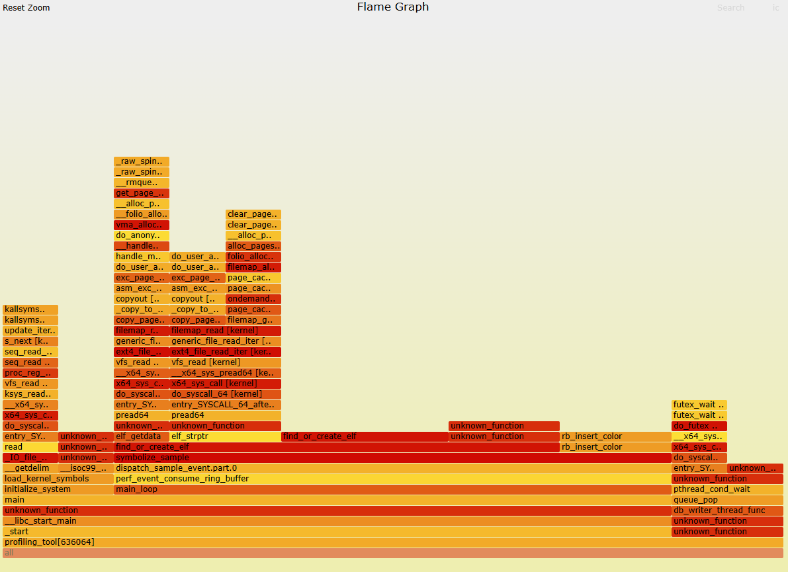
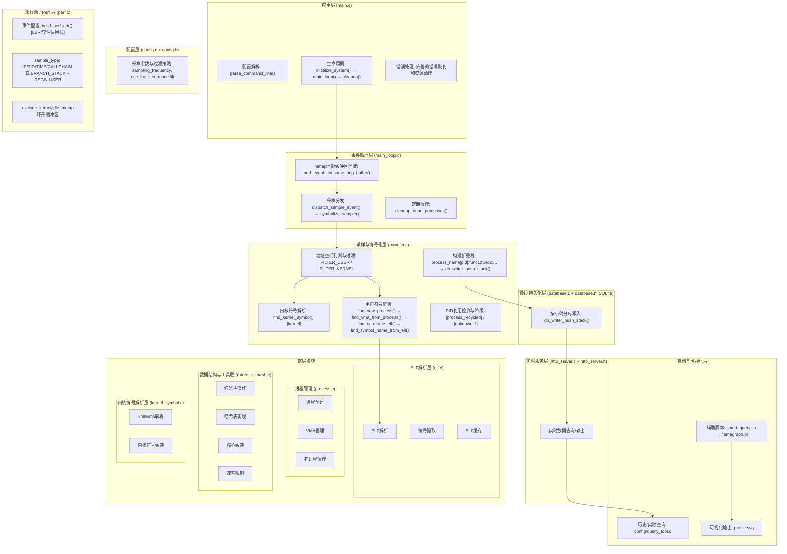

# 高精度Linux性能分析工具

本项目是一个基于Linux `perf_event` 子系统的高性能采样分析器。它能够实时地将运行时指令地址（IP）转换为具体的函数符号，从而帮助开发者精确地定位用户态和内核态的性能热点。

### 效果演示


## 核心能力

- **全栈符号化**: 同时支持用户态（ELF符号）和内核态（kallsyms符号）的地址解析。
- **双模式采样**: 支持基于软件定时器（默认，通用）和基于LBR硬件（可选，高精度）的两种采样模式。
- **实时符号化**: 采样地址到函数名的转换延迟极低，小于1毫秒。
- **系统级监控**: 能够监控系统上的所有进程，提供全局性能视图。
- **三级核心缓存**: 进程、ELF文件和内核符号三级缓存，最大化减少重复IO和解析开销。
- **高可靠栈回溯**: 可选LBR或Frame Pointer模式，用于生成高度精确的调用栈和火焰图。
- **内存安全**: 通过引用计数和定期清理机制，确保零内存泄漏。

## 🏗️ 架构详解

### 分层架构图



> 下面是同款架构的可视化图（带数据流箭头），可在浏览器直接查看：


## 依赖安装

在编译前，请确保已安装以下必要的开发库和符号包。

以Debian/Ubuntu为例：
```bash
sudo apt-get update
sudo apt-get install build-essential libelf-dev libsqlite3-dev libmicrohttpd-dev libcjson-dev libcurl4-openssl-dev
```

- `build-essential`: 提供 `gcc` 和 `make` 等基础编译工具。
- `libelf-dev`: ELF文件解析所需的核心库。
- `libsqlite3-dev`: 用于数据存储功能（SQLite）。
- `libmicrohttpd-dev`: 轻量级 HTTP 服务器库，用于内置管理/查询接口。
- `libcjson-dev`: 用于解析/构造 JSON 数据（配置、接口输出等）。
- `libcurl4-openssl-dev`: 查询工具 `query_tool` 的 HTTP 访问能力（下载/接口调用等）。

可选（符号包/调试符号）：
- 为了获得更完整的用户态/系统库符号，建议安装系统调试符号包（例如 libc 的 dbgsym/dbg、libstdc++ 的 dbgsym/dbg 等）。
- 未安装符号包时，程序仍可工作。
- 内核符号默认来自 `/proc/kallsyms`，通常无需额外安装。

## Quick start

### 1. 克隆项目
```bash
git clone <https://github.com/Vivy33/Profiling.git>
cd <Profiling>
```

### 2. 编译
直接运行 `make` 命令即可编译生成可执行文件。
```bash
make
```
安装历史数据库(7天)定时清理任务
```bash
sudo ./auto_manager.sh install
```

### 3. 运行

**重要提示**: 运行本工具需要 `root` 权限，因为它依赖于 `perf_event_open` 系统调用，需要root内核栈才可以解析。

**场景1: 标准性能分析 (默认软件采样)**
此模式适用于快速定位消耗CPU时间最长的“热点”函数。
```bash
# 以100Hz的频率监控所有进程（默认30hz）
sudo ./auto_manager.sh start --frequency=100
```

**场景2: 高精度调用栈分析 (LBR硬件采样)**
此模式使用CPU的LBR硬件功能，以极高的精度追踪函数调用路径，是生成可靠火焰图的首选。
```bash
# 启用LBR模式进行高精度分析
sudo ./auto_manager.sh start --frequency=100 --lbr
```

**场景3: 只分析内核空间**
```bash
# 仅对内核函数进行采样
sudo ./auto_manager.sh start --frequency=100 --filter=kernel
```

**场景4: 火焰图生成**
LBR模式是生成高质量火焰图的首选。为了生成火焰图，`profiling_tool`的输出需要被处理成`flamegraph.pl`脚本所要求的折叠堆栈格式（folded stack format），即每一行都是一个完整的调用栈，以分号分隔，最后是一个空格和样本数。
```bash
# 1. 使用分析器采集数据
# 注意：为了生成火焰图，您需要修改分析器使其输出折叠堆栈格式。
sudo ./smart_query.sh --time "last 10 minutes" --flame > folded_stacks.txt
”last“  通过http服务查询内存数据
其他格式 走sqlite数据库查询已经落盘的数据

# 2. 使用 flamegraph.pl 生成 SVG 火焰图
./flamegraph.pl folded_stacks.txt > profile.svg
```

## 自动化管理与查询

### 自动化管理脚本 (`auto_manager.sh`)

`auto_manager.sh` 是一个统一的性能分析管理脚本，简化了性能分析工具的启动、停止、状态查询和数据清理等操作。

**核心命令:**

- `start`: 启动性能分析（带自动清理）。
  - 选项: `--dir <PATH>`, `--frequency <HZ>`, `--filter <TYPE>`, `--cleanup <SEC>`, `--stack-depth <NUM>`, `--lbr`
- `stop`: 停止性能分析及后台清理守护进程。
- `status`: 查看性能分析工具、后台清理守护进程和 systemd 定时任务的状态。
- `cleanup`: 手动清理旧数据。
  - 选项: `--days <NUM>`, `--dry-run`
- `install`: 安装 systemd 定时任务，用于定期清理旧数据。
- `uninstall`: 卸载 systemd 定时任务。
- `logs`: 查看 `profiling_tool` 的实时日志。

**示例:**

```bash
# 默认启动性能分析（30Hz采样，所有空间，自动清理）
sudo ./auto_manager.sh start

# 以100Hz频率启动，只分析用户态，启用LBR
sudo ./auto_manager.sh start --frequency 100 --filter user --lbr

# 查看当前系统状态
./auto_manager.sh status

# 手动清理超过3天的旧数据（只显示不删除）
./auto_manager.sh cleanup --days 3 --dry-run

# 安装systemd定时任务，实现自动定期清理
sudo ./auto_manager.sh install
```

### 查询脚本 (`smart_query.sh`)

`smart_query.sh` 提供了一个人性化的接口来查询 `profiling_tool` 收集到的性能数据。它支持灵活的时间范围选择和多种过滤条件。

**选项:**

- `--dir <目录>`: 指定数据库目录 (默认: `./tmp`)。
- `--time <时间段>`: 人性化时间格式，支持多种表达方式。
  - 示例: `"15:10-15:30"`, `"2023-09-22 15:10-15:30"`, `"today 15:10"`, `"last 20 minutes"`, `"09:00-"`, `"-15:30"`
- `--pid <pid>`: 按进程ID过滤。
- `--name <名称>`: 按进程名过滤。
- `--flame`: 输出火焰图兼容格式（调用链 计数）。
- `--detailed`: 输出详细的调用栈信息。

**示例:**

```bash
# 查询今天15:10到15:30的性能数据
./smart_query.sh --time "15:10-15:30"

# 查询最近30分钟内，进程ID为1234的性能数据
./smart_query.sh --time "last 30 minutes" --pid 1234

# 查询最近5分钟内，进程名为nginx的性能数据，并输出火焰图兼容格式
./smart_query.sh --time "last 5 minutes" --name nginx --flame > flame_data.txt

# 查询最近10分钟内，输出详细调用栈信息
./smart_query.sh --time "last 10 minutes" --detailed
```

## 📚 相关技术文档
- [Linux perf_event_open系统调用](https://man7.org/linux/man-pages/man2/perf_event_open.2.html)
- [ELF文件格式规范](https://refspecs.linuxfoundation.org/elf/elf.pdf)
- [Linux虚拟内存管理](https://www.kernel.org/doc/html/latest/admin-guide/mm/index.html)
- [红黑树算法实现](https://www.kernel.org/doc/html/latest/core-api/rbtree.html)
- [火焰图生成工具](http://www.brendangregg.com/flamegraphs.html)
- [libelf库文档](https://sourceware.org/elfutils/)